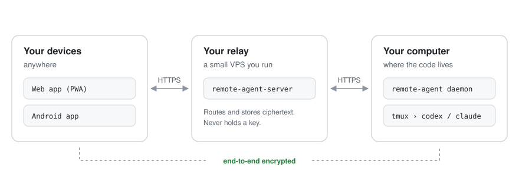

<div align="center">

# remote-agent

**Drive the AI coding CLIs on your own computer from any device.**<br>
Codex and Claude Code, running natively in tmux. End-to-end encrypted. Self-hosted.

[](https://github.com/Lewin671/remote-agent-releases/releases/latest)


English · [简体中文](README.zh-CN.md)

<picture>
  <source media="(prefers-color-scheme: dark)" srcset="assets/architecture-dark.svg">
  
</picture>

</div>

## What it does

You start Codex or Claude Code on your computer the way you always do. When you walk away, the same session is on your phone: read what the agent did, send the next message, approve or deny a permission request, interrupt it, or open the live terminal.

- **The real CLI, not a wrapper.** Agents run in their native interactive form inside tmux. The terminal on your desk and the app in your hand are the same session.
- **End-to-end encrypted.** Messages, tool calls, terminal output, project names and paths are encrypted on your devices. The relay stores and forwards ciphertext and never holds a key.
- **Self-hosted.** You run the relay on your own VPS and host the web client yourself. No account with us, no third-party chat platform in between.
- **Several computers, one view.** Run a daemon on each machine; clients group every session by project.

> [!NOTE]
> The app and web interface are in Simplified Chinese for now. This is an early, fast-moving project: see [Status](#status-and-limits) before you depend on it.

## Quick start

You need three things: a **relay** on a VPS, the **web client** on any static host, and the **daemon** on the computer where your code lives. The [self-hosting guide](docs/self-hosting.md) walks through each step; the short version:

**1. Relay** — on a Linux VPS with Docker, and a domain pointing at it:

```sh
curl -fsSL https://raw.githubusercontent.com/Lewin671/remote-agent-releases/main/install.sh | sh -s -- server
# set RELAY_DOMAIN and ALLOWED_ORIGINS in remote-agent-server/.env, then:
cd remote-agent-server && docker compose up -d --build
```

**2. Web client** — static files, for Cloudflare Pages or any HTTPS host:

```sh
curl -fsSL https://raw.githubusercontent.com/Lewin671/remote-agent-releases/main/install.sh | sh -s -- web
npx wrangler pages deploy remote-agent-web --project-name <your project>
```

**3. Your computer** — macOS or Linux, with tmux 3.2+ and a logged-in `codex` or `claude`:

```sh
curl -fsSL https://raw.githubusercontent.com/Lewin671/remote-agent-releases/main/install.sh | sh
remote-agent-service install                                  # run the daemon in the background
remote-agent account init --server https://ra.example.com     # asks for the relay's setup token
remote-agent account pair --web https://app.example.com       # shows a QR code for your phone
remote-agent codex                                            # or: remote-agent claude
```

Scan the QR code with your phone, and the session you just started is there.

## Downloads

Every [release](https://github.com/Lewin671/remote-agent-releases/releases/latest) carries the same version of every component:

| File | What it is | Runs on |
|---|---|---|
| `remote-agent-vX.Y.Z-<os>-<arch>.tar.gz` | The daemon and its command line, plus `remote-agent-service` to run it in the background | macOS and Linux, arm64 and amd64 |
| `remote-agent-server-vX.Y.Z-linux-<arch>.tar.gz` | The relay, with a Docker Compose setup that includes HTTPS | Linux, arm64 and amd64 |
| `remote-agent-web-vX.Y.Z.tar.gz` | The web client (installable as a PWA), as static files | Any HTTPS static host |
| `remote-agent-vX.Y.Z.apk` | The Android app | Android 8.0 and later |
| `SHA256SUMS` | Checksums of all of the above | |

`install.sh` picks the right file, checks it against `SHA256SUMS`, and installs it without root. Prefer to read it first? Download it, inspect it, then run it with `sh install.sh`. To check a download by hand:

```sh
sha256sum --check --ignore-missing SHA256SUMS      # macOS: shasum -a 256 --check --ignore-missing SHA256SUMS
```

The Android app is signed with one fixed key. Its certificate's SHA-256 fingerprint is:

```
8f:ea:c3:68:de:87:29:d5:25:ca:65:f7:40:36:83:27:17:76:68:af:e3:de:06:2a:df:09:3e:df:89:3f:20:cc
```

The app updates itself from this repository: **Settings › Version**.

## What the relay can see

The relay is treated as untrusted. If your VPS is compromised, what leaks is metadata, not content.

| | Visible to the relay |
|---|---|
| Messages, tool calls, terminal output, approval requests, images | No |
| Project names, paths, git remotes, session titles, machine names | No |
| Account and session keys | No |
| Device, machine and session IDs, timestamps, ciphertext sizes | Yes, needed for routing |
| Whether and when a session ended | Yes |

The web client is deliberately **not** served by the relay: a compromised relay could otherwise swap the page's JavaScript and bypass the encryption. Host it somewhere else, such as Cloudflare Pages.

## Status and limits

- **Closed source, for now.** This repository publishes binaries and documentation; the source code is not public. The encryption claims above therefore cannot be independently verified from this repository. Decide accordingly.
- **Pre-1.0.** Components of different versions are not guaranteed to work together, and stored data may need to be recreated between releases. Upgrade the daemon, relay, web client and app together, and read the release notes first: they state what an upgrade requires.
- **One account per relay.** A relay serves a single person's devices. There are no teams, sharing or multiple accounts.
- **No Android push notifications on your own relay.** The published app can only receive pushes sent through the maintainer's Firebase project, which your relay cannot use. The app works normally while open; for notifications, use the web client, which supports Web Push on any relay. The app still contains Firebase's messaging library and checks this repository for updates.
- **No iOS app.** Use the web client from Safari and add it to the Home Screen.
- **No support guarantee.** Bug reports are welcome in [Issues](https://github.com/Lewin671/remote-agent-releases/issues); never paste your account secret, setup token or pairing links there.

## License

The files in this repository's releases are provided free of charge for personal use, as is, without warranty of any kind. They include open-source software whose license texts are in `THIRD_PARTY_NOTICES.txt` inside each archive.
